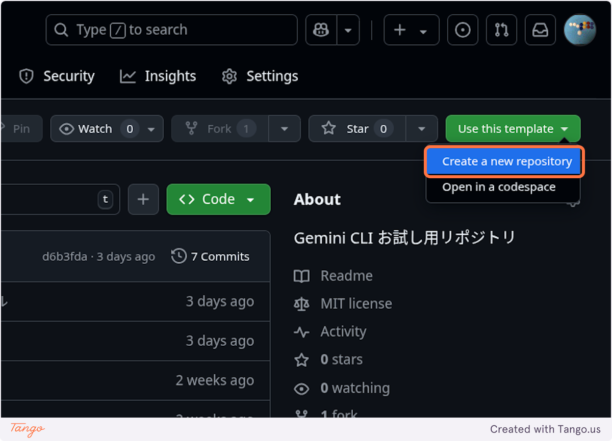
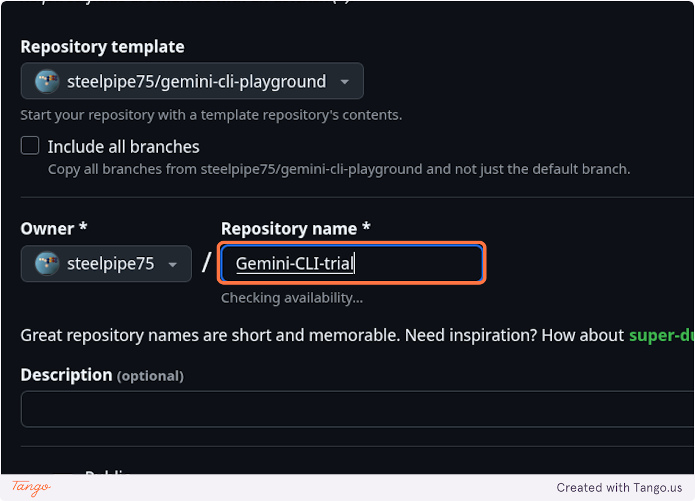
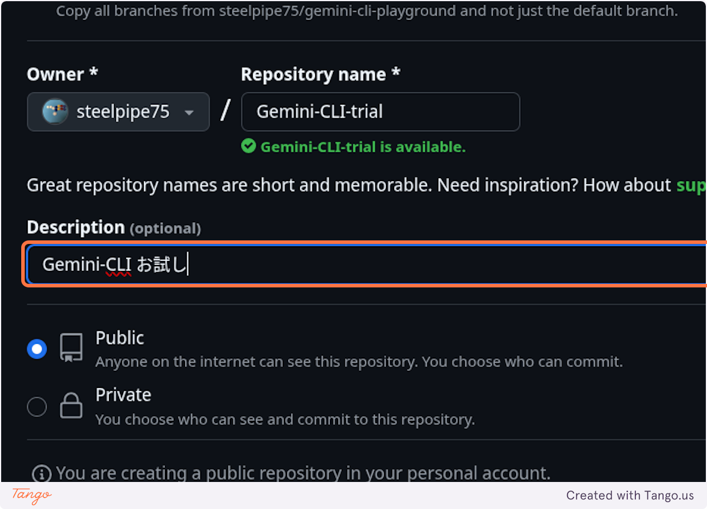
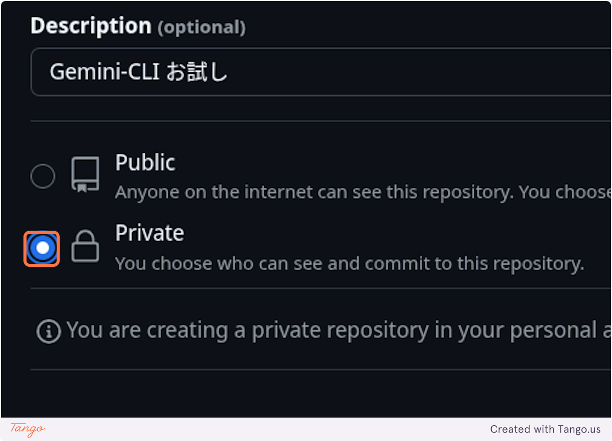
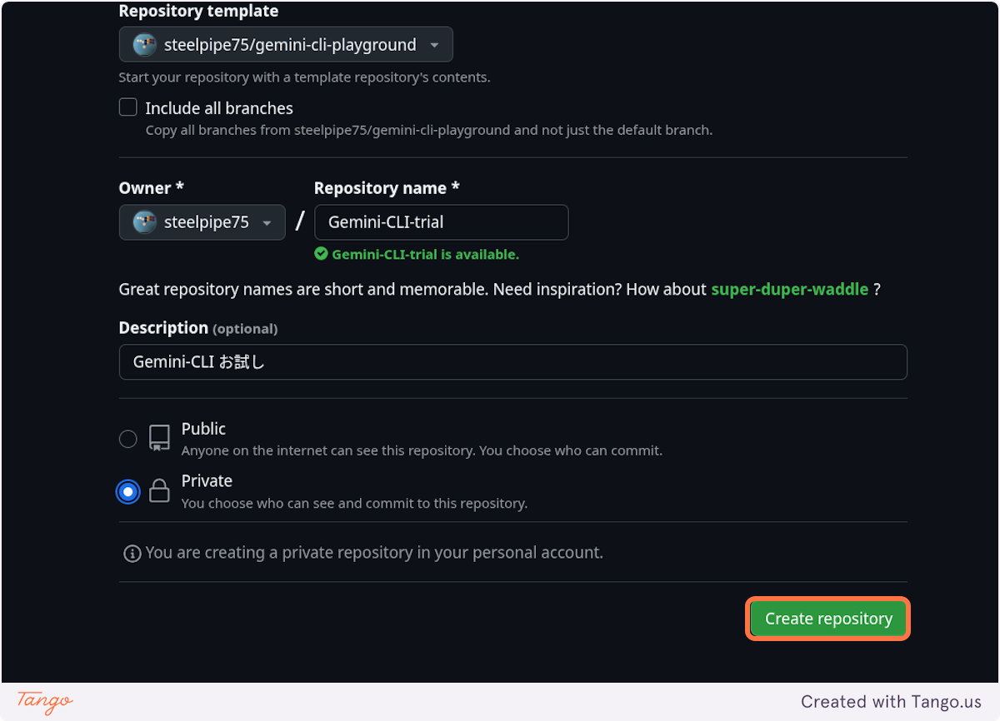
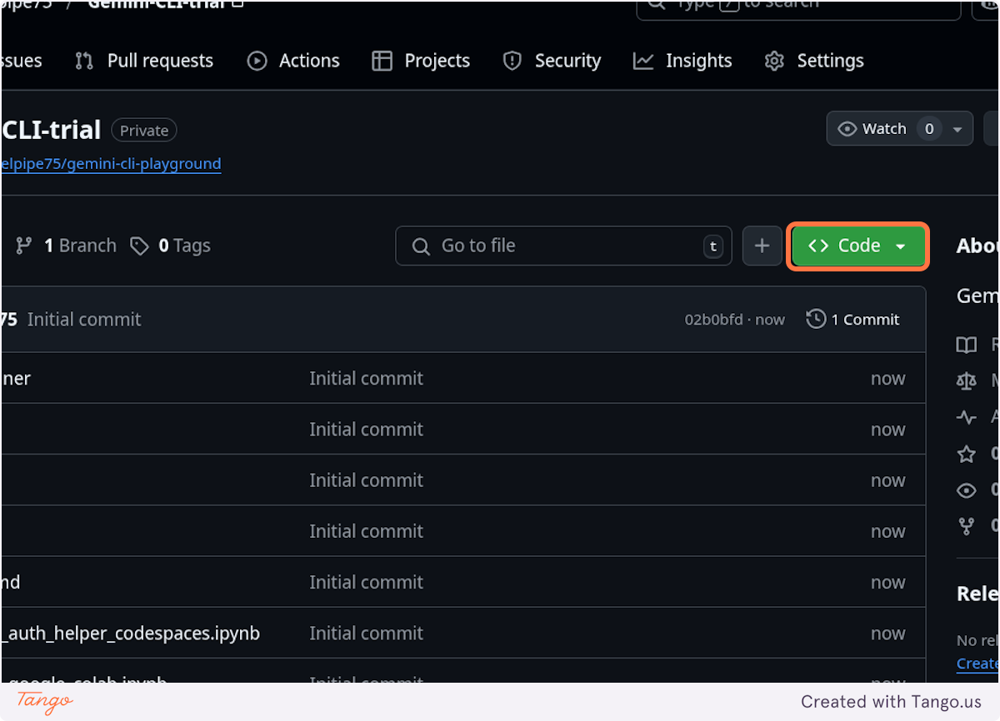
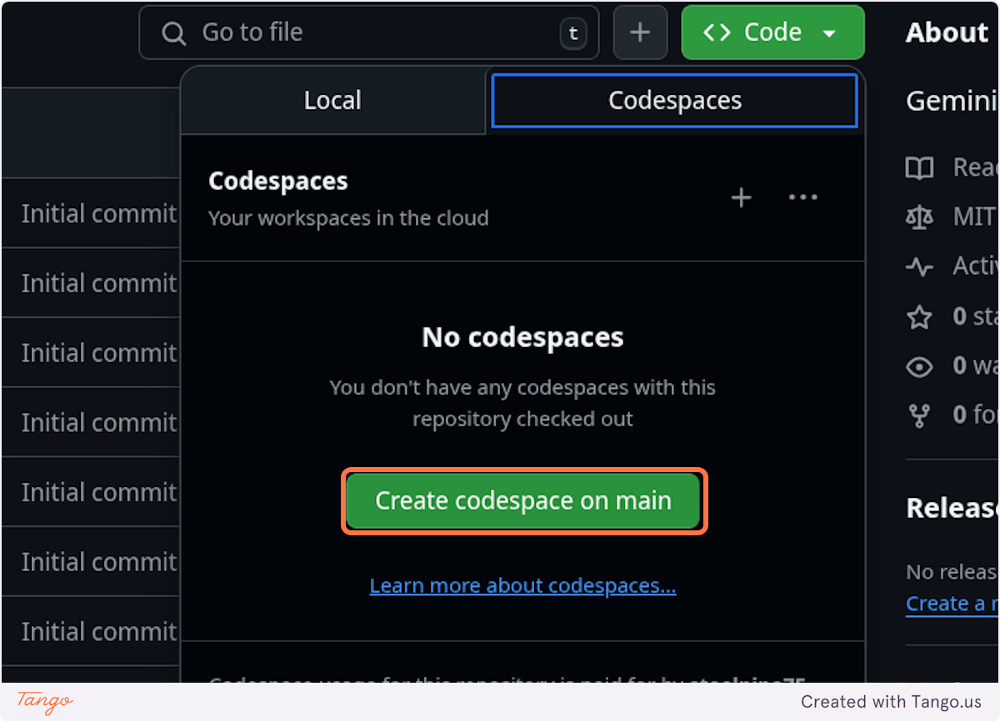

# gemini-cli-playground

Gemini CLI お試し用リポジトリ

## 使い方

### このテンプレートリポジトリを元にリポジトリを作る

#### Step.1 "Use this template" をクリック

#### Step.2 "Create a new repository" をクリック

#### Step.3 リポジトリに名前をつける

#### Step.4 リポジトリの説明を記載

#### Step.5 リポジトリをPrivateに設定

#### Step.6 "Create repository" をクリック

### 作ったリポジトリで GitHub Codespace を起動

#### Step.7 "<>Code" をクリック

#### Step.8 "Create codespace on main" をクリック

.devcontainer/devcontainer.json のpostCreateCommandに記載した設定に従い Codespacesの起動時にGemini-CLIがインストールされるのを待つ

## 参考記事

- [SSH先でgemini-cliを使うために認証をどうにかする : https://zenn.dev/yuys13/articles/gemini-cli-with-ssh](https://zenn.dev/yuys13/articles/gemini-cli-with-ssh)
- [🚀🚀🚀Gemini CLIをGoogle Colabで実行する！🚀🚀🚀 : https://zenn.dev/yakann/articles/89eb06dee3a4b0](https://zenn.dev/yakann/articles/89eb06dee3a4b0)
- [1時間でGemini CLIとLINE Bot : Chapter 03 Vibe Codingの環境準備](https://zenn.dev/n0bisuke/books/geminicli-linebot/viewer/1-1_setup)
